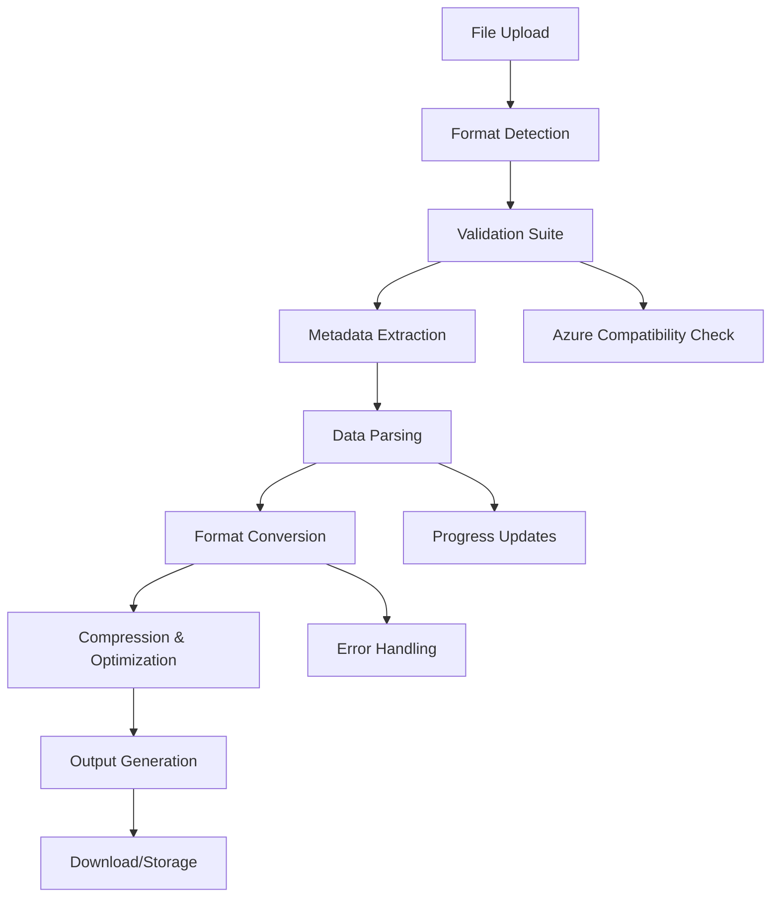

# 🏗️ System Architecture

## Overview

The Seismic Format Converter is built as a modern, client-side web application using React 19 and TypeScript. The architecture emphasizes **type safety**, **modularity**, and **cloud optimization** for seismic data processing workflows.

## 🎯 Design Principles

### **1. Client-Side Processing**
- **No Server Dependency**: All conversion logic runs in the browser
- **Privacy First**: Sensitive seismic data never leaves the user's machine
- **Offline Capability**: Works without internet connection after initial load
- **Progressive Enhancement**: Graceful degradation on older browsers

### **2. Component-Based Architecture**
- **Modular Design**: Self-contained, reusable components
- **Single Responsibility**: Each component has a focused purpose
- **Props-Based Communication**: Predictable data flow
- **Error Boundaries**: Isolated failure domains

### **3. Type Safety First**
- **Full TypeScript Coverage**: No any types in production code
- **Interface-Driven Development**: Clear contracts between components
- **Compile-Time Validation**: Catch errors before runtime
- **Auto-Generated Documentation**: Types serve as documentation

## 🏛️ Application Architecture

```
┌─────────────────────────────────────────────────────────────┐
│                     Browser (Client-Side)                   │
├─────────────────────────────────────────────────────────────┤
│  ┌─────────────────┐  ┌──────────────────┐  ┌──────────────┐ │
│  │   User Interface │  │  State Management │  │ Data Storage │ │
│  │                 │  │                  │  │              │ │
│  │ • FileUploadZone│  │ • React Hooks    │  │ • IndexedDB  │ │
│  │ • FormatSelector│  │ • useKV Hook     │  │ • LocalStorage│ │
│  │ • ConversionTest│  │ • Error Boundary │  │ • File API   │ │
│  │ • ProgressView  │  │ • Progress State │  │              │ │
│  └─────────────────┘  └──────────────────┘  └──────────────┘ │
├─────────────────────────────────────────────────────────────┤
│  ┌─────────────────────────────────────────────────────────┐ │
│  │                Business Logic Layer                     │ │
│  │                                                         │ │
│  │ ┌─────────────────┐  ┌─────────────────┐  ┌───────────┐ │ │
│  │ │ SeismicConverter│  │ FormatDetector  │  │ Validators│ │ │
│  │ │                 │  │                 │  │           │ │ │
│  │ │ • 21 Parsers    │  │ • Magic Numbers │  │ • Azure   │ │ │
│  │ │ • HDF5 Output   │  │ • Extension Map │  │ • Integrity│ │ │
│  │ │ • OVDS Creation │  │ • Header Analysis│  │ • Geometry│ │ │
│  │ │ • Azure Compat  │  │ • MIME Detection│  │           │ │ │
│  │ └─────────────────┘  └─────────────────┘  └───────────┘ │ │
│  └─────────────────────────────────────────────────────────┘ │
├─────────────────────────────────────────────────────────────┤
│  ┌─────────────────────────────────────────────────────────┐ │
│  │                  Data Processing Layer                  │ │
│  │                                                         │ │
│  │ ┌──────────────┐ ┌──────────────┐ ┌──────────────────┐ │ │
│  │ │ Binary I/O   │ │ Compression  │ │ Format Writers   │ │ │
│  │ │              │ │              │ │                  │ │ │
│  │ │ • ArrayBuffer│ │ • Wavelet    │ │ • HDF5 Structure │ │ │
│  │ │ • DataView   │ │ • ZSTD       │ │ • OVDS Layout    │ │ │
│  │ │ • TypedArrays│ │ • Lossless   │ │ • ZGY Bricks     │ │ │
│  │ │ • Stream API │ │ • Chunking   │ │ • JSON Export    │ │ │
│  │ └──────────────┘ └──────────────┘ └──────────────────┘ │ │
│  └─────────────────────────────────────────────────────────┘ │
└─────────────────────────────────────────────────────────────┘
```

## 📦 Component Hierarchy

### **Root Application**
```typescript
App.tsx
├── ErrorBoundary          // Global error handling
└── ConversionWorkflow
    ├── FileUploadZone     // Drag & drop interface
    ├── FormatSelector     // Target format selection
    ├── FormatInfo         // Conversion information
    ├── ConversionTest     // Validation suite
    ├── ProgressView       // Real-time progress
    └── ConversionHistory  // Previous conversions
```

### **Component Responsibilities**

#### **FileUploadZone**
```typescript
interface FileUploadZoneProps {
  onFileSelect: (file: File) => void
  accept?: string[]
  maxSize?: number
}
```
- **Purpose**: Handle file input and validation
- **Features**: Drag & drop, format detection, size validation
- **State**: Upload progress, validation errors

#### **FormatSelector**
```typescript
interface FormatSelectorProps {
  value: string
  onChange: (format: string) => void
  sourceFormat?: string
  disabled?: boolean
}
```
- **Purpose**: Select target conversion format
- **Features**: Format filtering, compatibility warnings
- **Logic**: Azure-optimized format recommendations

#### **ConversionTest**
```typescript
interface ConversionTestProps {
  sourceFile?: File
  onTestComplete: (results: TestResults) => void
}
```
- **Purpose**: Validate conversion capabilities
- **Features**: Multi-step testing, Azure compatibility
- **Output**: Detailed validation report

## 🔧 Core Services

### **SeismicConverter Service**

The heart of the application - handles all format conversions:

```typescript
class SeismicConverter {
  // 21 format-specific parsers
  private static readonly PARSERS = {
    'SEG-Y': parseSEGY,
    'SEG-D': parseSEGD,
    'NetCDF': parseNetCDF,
    // ... 18 more formats
  }

  // Azure-optimized conversion strategies
  static async convert(
    file: File, 
    config: ConversionConfig,
    progressCallback?: (progress: number) => void
  ): Promise<ConversionResult>
}
```

**Key Features:**
- **Format Detection**: Automatic source format identification
- **Metadata Extraction**: Preserve seismic acquisition parameters
- **Progressive Processing**: Stream-based conversion for large files
- **Error Recovery**: Graceful handling of corrupted data
- **Azure Integration**: Optimized for Energy Data Services workflow

### **Format Detection Engine**

```typescript
interface FormatDetector {
  detectFormat(file: File): Promise<FormatInfo>
  validateFormat(file: File, expectedFormat: string): Promise<boolean>
  getSupportedFormats(): FormatDefinition[]
}
```

**Detection Strategy:**
1. **File Extension Analysis**: Primary format hint
2. **Magic Number Detection**: Binary signature verification
3. **Header Structure Analysis**: Format-specific validation
4. **Content Sampling**: Statistical format inference

## 🗄️ Data Flow Architecture

### **Conversion Pipeline**



### **State Management**

```typescript
// Application state structure
interface AppState {
  currentFile: SeismicFile | null
  targetFormat: string
  conversionJob: ConversionJob | null
  conversionHistory: ConversionJob[]
  validationResults: TestResults | null
}

// Persistent storage
const [conversionHistory, setConversionHistory] = useKV<ConversionJob[]>(
  'conversion-history', 
  []
)
```

**State Flow:**
1. **File Selection** → Updates `currentFile`
2. **Format Detection** → Updates file metadata
3. **Conversion Start** → Creates `conversionJob`
4. **Progress Updates** → Updates job progress
5. **Completion** → Adds to `conversionHistory`

## ⚡ Performance Optimizations

### **Memory Management**

```typescript
// Streaming file processing
class StreamingProcessor {
  async processLargeFile(file: File, chunkSize: number = 1024 * 1024) {
    const chunks = []
    let offset = 0
    
    while (offset < file.size) {
      const chunk = file.slice(offset, offset + chunkSize)
      const processed = await this.processChunk(await chunk.arrayBuffer())
      chunks.push(processed)
      offset += chunkSize
      
      // Yield control to prevent UI blocking
      await new Promise(resolve => setTimeout(resolve, 0))
    }
    
    return this.combineChunks(chunks)
  }
}
```

### **Web Worker Integration** (Future Enhancement)

```typescript
// Offload heavy processing to Web Workers
class ConversionWorker {
  private worker: Worker
  
  async convertInBackground(
    file: File, 
    config: ConversionConfig
  ): Promise<ConversionResult> {
    return new Promise((resolve, reject) => {
      this.worker.postMessage({ file, config })
      this.worker.onmessage = (event) => {
        if (event.data.type === 'progress') {
          // Update UI progress
        } else if (event.data.type === 'complete') {
          resolve(event.data.result)
        }
      }
    })
  }
}
```

## 🌐 Cloud Architecture Considerations

### **Azure Energy Data Services Integration**

```typescript
interface AzureCompatibility {
  validateForAzure(file: File): Promise<AzureValidationResult>
  optimizeForCloud(data: ArrayBuffer): Promise<OptimizedData>
  generateMetadata(source: SeismicMetadata): AzureMetadata
}
```

**Azure Optimization Features:**
- **OVDS Format**: Open Volumetric Data Standard for cloud streaming
- **Level of Detail**: Multiple resolutions for efficient access
- **Spatial Indexing**: 3D octree structure for query optimization
- **Compression Strategy**: Wavelet + ZSTD for optimal cloud storage

### **Deployment Architecture**

```
┌─────────────────────────────────────────────────────────────┐
│                       Cloud Infrastructure                  │
├─────────────────────────────────────────────────────────────┤
│  ┌─────────────────┐  ┌──────────────────┐  ┌──────────────┐ │
│  │   Static Hosting │  │  Azure Blob      │  │  Azure EDS   │ │
│  │                 │  │  Storage         │  │  Integration │ │
│  │ • GitHub Pages  │  │                  │  │              │ │
│  │ • Netlify       │  │ • File Upload    │  │ • API Access │ │
│  │ • Azure Static  │  │ • Large Files    │  │ • Metadata   │ │
│  │ • Vercel        │  │ • Temp Storage   │  │ • Workflow   │ │
│  └─────────────────┘  └──────────────────┘  └──────────────┘ │
└─────────────────────────────────────────────────────────────┘
```

## 🔒 Security Considerations

### **Client-Side Security**
- **No Server Upload**: Sensitive data stays local
- **Input Validation**: Comprehensive file validation
- **Memory Safety**: Bounded memory allocation
- **Error Isolation**: Component-level error boundaries

### **Data Privacy**
- **Local Processing**: No data transmission to external servers
- **Temporary Storage**: Automatic cleanup of processed data
- **Secure APIs**: Use of modern browser security features

## 📊 Monitoring & Observability

### **Error Tracking**
```typescript
class ErrorReporter {
  reportConversionError(error: ConversionError, context: ErrorContext) {
    // Log to console in development
    console.error('Conversion Error:', { error, context })
    
    // Optional: Send to monitoring service in production
    if (process.env.NODE_ENV === 'production') {
      this.sendToMonitoring({ error, context })
    }
  }
}
```

### **Performance Metrics**
```typescript
interface ConversionMetrics {
  fileSize: number
  processingTime: number
  compressionRatio: number
  memoryUsage: number
  conversionAccuracy: number
}
```

---

## 🎯 Future Architecture Enhancements

### **Planned Improvements**
1. **Web Workers**: Background processing for large files
2. **Service Workers**: Offline capability and caching
3. **WebAssembly**: High-performance format parsers
4. **Streaming API**: Real-time conversion progress
5. **IndexedDB**: Enhanced local storage
6. **Progressive Web App**: Native app-like experience

### **Scalability Considerations**
- **Micro-frontend Architecture**: Modular deployment
- **API Gateway**: Centralized service management
- **Container Deployment**: Docker-based scaling
- **CDN Integration**: Global content delivery

---

*This architecture ensures the Seismic Format Converter remains maintainable, scalable, and optimized for professional seismic data workflows.*