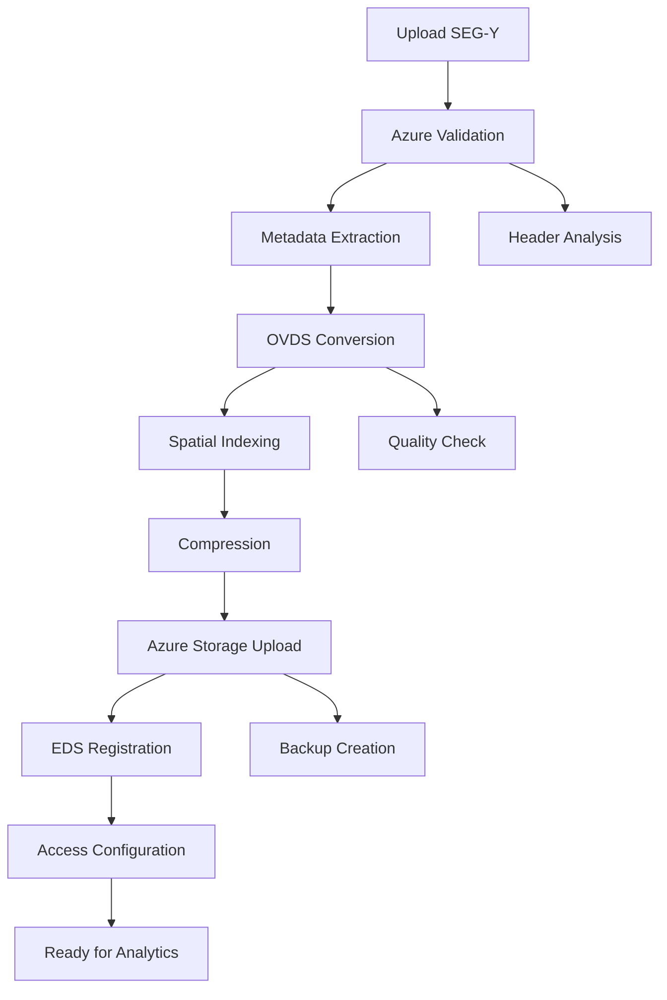

# ☁️ Azure Integration Guide

Complete guide to integrating the Seismic Format Converter with Microsoft Azure Energy Data Services for cloud-native seismic data workflows.

## 🎯 Overview

Azure Energy Data Services provides a comprehensive platform for managing, processing, and analyzing energy industry data at scale. This guide covers the complete integration workflow from local conversion to cloud deployment.

## 🏗️ Azure Energy Data Services Architecture

```
┌─────────────────────────────────────────────────────────────┐
│                    Azure Energy Data Services              │
├─────────────────────────────────────────────────────────────┤
│  ┌─────────────────┐  ┌──────────────────┐  ┌──────────────┐ │
│  │   Data Manager  │  │  Seismic Store   │  │  Well Store  │ │
│  │                 │  │                  │  │              │ │
│  │ • Data Ingestion│  │ • OVDS Support   │  │ • LAS Files  │ │
│  │ • Metadata Mgmt │  │ • ZGY Support    │  │ • DLIS Files │ │
│  │ • Access Control│  │ • SEG-Y Import   │  │ • Well Logs  │ │
│  │ • Data Lineage  │  │ • Streaming API  │  │ • Perf Data  │ │
│  └─────────────────┘  └──────────────────┘  └──────────────┘ │
├─────────────────────────────────────────────────────────────┤
│  ┌─────────────────────────────────────────────────────────┐ │
│  │                Processing Services                      │ │
│  │                                                         │ │
│  │ ┌─────────────────┐  ┌─────────────────┐  ┌───────────┐ │ │
│  │ │ Analytics Engine│  │ ML/AI Platform  │  │ Workflows │ │ │
│  │ │                 │  │                 │  │           │ │ │
│  │ │ • Slice Extract │  │ • Data Science  │  │ • ETL     │ │ │
│  │ │ • Visualization │  │ • AI Training   │  │ • QC      │ │ │
│  │ │ • Statistics    │  │ • Prediction    │  │ • Reports │ │ │
│  │ └─────────────────┘  └─────────────────┘  └───────────┘ │ │
│  └─────────────────────────────────────────────────────────┘ │
└─────────────────────────────────────────────────────────────┘
```

## 🚀 Getting Started with Azure

### **Prerequisites**

| Requirement | Details |
|-------------|---------|
| **Azure Subscription** | Active Azure subscription with Energy Data Services |
| **Resource Group** | Dedicated resource group for energy data |
| **Storage Account** | Azure Blob Storage for data files |
| **Permissions** | Energy Data Services Contributor role |

### **Azure Setup**

#### **1. Create Energy Data Services Instance**

```bash
# Azure CLI setup
az login
az account set --subscription "your-subscription-id"

# Create resource group
az group create \
  --name rg-energy-data \
  --location eastus

# Create Energy Data Services instance
az energy-service create \
  --resource-group rg-energy-data \
  --name your-energy-service \
  --location eastus \
  --sku S1
```

#### **2. Configure Storage Account**

```bash
# Create storage account for seismic data
az storage account create \
  --resource-group rg-energy-data \
  --name seismicdata$(date +%s) \
  --location eastus \
  --sku Standard_LRS \
  --kind StorageV2

# Create container for OVDS files
az storage container create \
  --account-name seismicdata123456 \
  --name ovds-data \
  --auth-mode login
```

#### **3. Set up Service Principal**

```bash
# Create service principal for automation
az ad sp create-for-rbac \
  --name seismic-converter-sp \
  --role "Energy Data Services Contributor" \
  --scopes /subscriptions/{subscription-id}/resourceGroups/rg-energy-data

# Output will include:
# - appId (client ID)
# - password (client secret)
# - tenant
```

## 🔧 Integration Configuration

### **Environment Variables**

Create `.env.azure` configuration:

```bash
# Azure Energy Data Services
AZURE_CLIENT_ID=your-service-principal-client-id
AZURE_CLIENT_SECRET=your-service-principal-secret
AZURE_TENANT_ID=your-azure-tenant-id
AZURE_SUBSCRIPTION_ID=your-subscription-id

# Energy Data Services
AZURE_EDS_ENDPOINT=https://your-energy-service.energy.azure.com
AZURE_EDS_DATA_PARTITION=your-data-partition

# Storage Configuration
AZURE_STORAGE_ACCOUNT=seismicdata123456
AZURE_STORAGE_CONTAINER=ovds-data
AZURE_STORAGE_CONNECTION_STRING=your-connection-string

# Application Settings
AZURE_REGION=eastus
AZURE_ENVIRONMENT=production
```

### **Converter Configuration**

Update the converter for Azure integration:

```typescript
// Azure-specific configuration
interface AzureConfig extends ConversionConfig {
  azureCompatible: true
  targetFormat: 'OVDS' | 'ZGY' | 'HDF5'
  dataPartition: string
  storageAccount: string
  containerName: string
  accessTier: 'hot' | 'cool' | 'archive'
}

// Example Azure conversion
const azureConversion: AzureConfig = {
  sourceFormat: 'SEG-Y',
  targetFormat: 'OVDS',
  azureCompatible: true,
  compressionLevel: 6,
  dataPartition: 'opendes',
  storageAccount: 'seismicdata123456',
  containerName: 'ovds-data',
  accessTier: 'hot',
  preserveMetadata: true,
  spatialIndexing: true,
  lodLevels: 8
}
```

## 📊 Azure-Optimized Formats

### **OVDS (Open Volumetric Data Standard)**

**Why OVDS for Azure:**
- **Streaming Access**: Optimized for cloud storage patterns
- **Level of Detail**: Multiple resolutions for different use cases  
- **Spatial Indexing**: Efficient slice extraction
- **Compression**: Smart compression for bandwidth optimization

**OVDS Structure for Azure:**
```typescript
const azureOVDSStructure = {
  header: {
    format: 'OVDS',
    version: '1.2',
    createdBy: 'Azure Energy Data Services Converter',
    azureOptimized: true,
    dataPartition: 'opendes'
  },
  volumeInfo: {
    dimensionality: 3,
    lodLevels: 8,        // 8 levels of detail
    brickSize: [64, 64, 64],  // Optimized for Azure Blob
    compression: 'wavelet_zstd'
  },
  azureMetadata: {
    storageAccount: 'seismicdata123456',
    containerName: 'ovds-data',
    accessTier: 'hot',
    redundancy: 'LRS',
    encryptionScope: 'default'
  },
  spatialIndex: {
    type: 'octree',
    depth: 8,
    chunkSize: [64, 64, 64],
    indexingStrategy: 'morton_order'
  }
}
```

### **ZGY (Schlumberger Petrel Format)**

**Azure ZGY Benefits:**
- **Native Azure Support**: Direct Petrel cloud integration
- **Brick Architecture**: Optimal for cloud access patterns
- **Lossless Compression**: Preserves original data fidelity
- **Metadata Integration**: Rich geological metadata

```typescript
const azureZGYConfig = {
  sourceFormat: 'SEG-Y',
  targetFormat: 'ZGY',
  azureCompatible: true,
  brickLayout: true,
  compression: 'lossless',
  metadata: {
    survey: 'Azure_3D_Survey_2024',
    dataPartition: 'opendes',
    coordinate_system: 'UTM_Zone_31N',
    units: 'metric'
  },
  azureOptimization: {
    chunkingStrategy: 'spatial_locality',
    accessPattern: 'random_slice',
    storageClass: 'premium'
  }
}
```

## 🔄 Azure Conversion Workflow

### **Complete SEG-Y to Azure Pipeline**



### **Conversion Implementation**

```typescript
import { AzureEnergyDataServices } from '@azure/energy-data-services'
import { BlobServiceClient } from '@azure/storage-blob'

class AzureSeismicConverter {
  private edsClient: AzureEnergyDataServices
  private blobClient: BlobServiceClient
  
  constructor(config: AzureConfig) {
    this.edsClient = new AzureEnergyDataServices({
      endpoint: config.edsEndpoint,
      credentials: new DefaultAzureCredential()
    })
    
    this.blobClient = new BlobServiceClient(
      config.storageConnectionString
    )
  }

  async convertAndUpload(
    file: File, 
    config: AzureConfig
  ): Promise<AzureConversionResult> {
    
    // Step 1: Validate for Azure compatibility
    const validation = await this.validateForAzure(file)
    if (!validation.isCompatible) {
      throw new Error('File not compatible with Azure EDS')
    }

    // Step 2: Convert to Azure-optimized format
    const conversion = await SeismicConverter.convert(file, {
      ...config,
      azureCompatible: true,
      targetFormat: 'OVDS'
    })

    // Step 3: Upload to Azure Blob Storage
    const uploadResult = await this.uploadToAzureStorage(
      conversion.outputData,
      config
    )

    // Step 4: Register with Energy Data Services
    const registration = await this.registerWithEDS(
      uploadResult.url,
      conversion.metadata,
      config
    )

    // Step 5: Configure access permissions
    await this.configureAccess(registration.datasetId, config)

    return {
      success: true,
      azureUrl: uploadResult.url,
      datasetId: registration.datasetId,
      metadata: conversion.metadata,
      accessEndpoint: registration.accessEndpoint
    }
  }

  private async validateForAzure(file: File): Promise<AzureValidation> {
    // Azure-specific validation logic
    const maxSize = 50 * 1024 * 1024 * 1024 // 50GB limit
    const supportedFormats = ['SEG-Y', 'SEG-D', 'LAS', 'DLIS']
    
    return {
      isCompatible: file.size <= maxSize,
      formatSupported: true,
      recommendations: [
        'Consider OVDS format for optimal cloud performance',
        'Enable spatial indexing for slice extraction',
        'Use hot storage tier for active datasets'
      ]
    }
  }

  private async uploadToAzureStorage(
    data: ArrayBuffer,
    config: AzureConfig
  ): Promise<UploadResult> {
    
    const containerClient = this.blobClient.getContainerClient(
      config.containerName
    )
    
    const blobName = `${config.dataPartition}/${Date.now()}.ovds`
    const blockBlobClient = containerClient.getBlockBlobClient(blobName)
    
    // Upload with optimized settings for seismic data
    const uploadResponse = await blockBlobClient.uploadData(data, {
      blobHTTPHeaders: {
        blobContentType: 'application/x-ovds',
        blobCacheControl: 'max-age=3600'
      },
      metadata: {
        dataType: 'seismic',
        format: 'OVDS',
        version: '1.2'
      },
      tier: config.accessTier
    })
    
    return {
      url: blockBlobClient.url,
      etag: uploadResponse.etag,
      lastModified: uploadResponse.lastModified
    }
  }

  private async registerWithEDS(
    blobUrl: string,
    metadata: SeismicMetadata,
    config: AzureConfig
  ): Promise<EDSRegistration> {
    
    const dataset = {
      kind: 'osdu:wks:dataset--File.Generic:1.0.0',
      data: {
        DatasetProperties: {
          FileSourceInfo: {
            FileSource: blobUrl,
            Name: metadata.fileName
          }
        },
        SeismicMetadata: {
          format: metadata.format,
          dimensions: metadata.dimensions,
          samplingRate: metadata.samplingRate,
          coordinateSystem: metadata.coordinateSystem,
          acquisitionParameters: metadata.acquisitionParameters
        }
      }
    }
    
    const response = await this.edsClient.dataset.createOrUpdate(
      config.dataPartition,
      dataset
    )
    
    return {
      datasetId: response.id,
      accessEndpoint: `${config.edsEndpoint}/api/dataset/${response.id}`
    }
  }
}
```

## 📈 Performance Optimization for Azure

### **Blob Storage Optimization**

```typescript
const storageOptimization = {
  // Optimal blob size for seismic data
  chunkSize: 64 * 1024 * 1024, // 64MB chunks
  
  // Access tier strategy
  accessTier: {
    active_data: 'hot',        // < 30 days
    recent_data: 'cool',       // 30-90 days  
    archive_data: 'archive'    // > 90 days
  },
  
  // Compression settings
  compression: {
    algorithm: 'zstd',
    level: 6,
    streaming: true
  },
  
  // Spatial indexing
  indexing: {
    type: 'octree',
    depth: 8,
    chunkSize: [64, 64, 64]
  }
}
```

### **Network Optimization**

```typescript
const networkConfig = {
  // Parallel upload for large files
  concurrency: 4,
  
  // Retry strategy
  retryOptions: {
    maxRetries: 3,
    retryDelay: 1000,
    exponentialBackoff: true
  },
  
  // Bandwidth optimization
  transferOptions: {
    chunkSize: 8 * 1024 * 1024,  // 8MB chunks
    maxConcurrency: 4
  }
}
```

## 🔐 Security and Compliance

### **Data Encryption**

```typescript
const securityConfig = {
  // Encryption at rest
  encryption: {
    type: 'Microsoft.Storage/storageAccounts',
    keySource: 'Microsoft.Storage',
    requireInfrastructureEncryption: true
  },
  
  // Encryption in transit
  transport: {
    httpsOnly: true,
    tlsVersion: '1.2'
  },
  
  // Access control
  access: {
    allowBlobPublicAccess: false,
    networkRules: {
      defaultAction: 'Deny',
      allowedIpRanges: ['your-office-ip/32']
    }
  }
}
```

### **Compliance Features**

- **GDPR Compliance**: Data residency and deletion capabilities
- **Industry Standards**: Compliant with energy industry regulations
- **Audit Logging**: Complete access and modification tracking
- **Data Lineage**: Track data processing and transformation history

## 📊 Monitoring and Analytics

### **Azure Monitor Integration**

```typescript
const monitoringConfig = {
  // Application Insights
  insights: {
    instrumentationKey: 'your-insights-key',
    trackDependencies: true,
    trackExceptions: true,
    trackPageViews: true
  },
  
  // Custom metrics
  metrics: {
    conversionTime: 'time_to_convert',
    fileSize: 'input_file_size',
    compressionRatio: 'compression_efficiency',
    uploadSpeed: 'azure_upload_mbps'
  },
  
  // Alerts
  alerts: [
    {
      name: 'Large File Conversion',
      condition: 'fileSize > 5GB',
      action: 'email_admin'
    },
    {
      name: 'Conversion Failure',
      condition: 'conversionSuccess == false',
      action: 'create_incident'
    }
  ]
}
```

### **Performance Dashboard**

Key metrics to track:
- **Conversion Success Rate**: Percentage of successful conversions
- **Average Processing Time**: Time per GB of input data
- **Storage Efficiency**: Compression ratios achieved
- **Azure Costs**: Storage and compute costs per conversion
- **User Adoption**: Number of conversions per month

## 🎯 Best Practices

### **Data Organization**

```
Azure Storage Structure:
├── hot/
│   ├── active-surveys/
│   │   ├── survey-2024-01/
│   │   │   ├── seismic.ovds
│   │   │   ├── metadata.json
│   │   │   └── index.spatial
│   │   └── survey-2024-02/
│   └── well-logs/
├── cool/
│   └── recent-surveys/
└── archive/
    └── historical-data/
```

### **Cost Optimization**

1. **Lifecycle Management**: Automatic tier transitions
2. **Compression Strategy**: Balance between size and access speed
3. **Regional Storage**: Use closest Azure region
4. **Reserved Capacity**: Pre-purchase storage for predictable workloads

### **Disaster Recovery**

```typescript
const drConfig = {
  // Backup strategy
  backup: {
    frequency: 'daily',
    retention: '90 days',
    crossRegion: true
  },
  
  // Replication
  replication: {
    type: 'GRS', // Geo-redundant storage
    readAccess: true
  }
}
```

## 🚀 Advanced Features

### **Real-time Streaming**

```typescript
// Stream OVDS data directly from Azure
const streamingConfig = {
  endpoint: 'https://your-storage.blob.core.windows.net',
  containerName: 'ovds-data',
  streamingMode: 'adaptive',
  bufferSize: '64MB',
  qualityLevels: [
    { name: 'high', lodLevel: 0 },
    { name: 'medium', lodLevel: 2 },
    { name: 'low', lodLevel: 4 }
  ]
}
```

### **Machine Learning Integration**

```typescript
// Prepare data for Azure ML
const mlPreparation = {
  format: 'HDF5',
  structure: {
    training_data: '/ml/training',
    validation_data: '/ml/validation',
    test_data: '/ml/test'
  },
  features: ['amplitude', 'frequency', 'phase'],
  labels: ['lithology', 'porosity', 'permeability']
}
```

---

## 🎯 Next Steps

1. **[Set up Azure account](https://azure.microsoft.com/free/)**
2. **[Deploy the converter to Azure](Deployment.md#azure-deployment)**
3. **[Configure automated workflows](Examples-and-Usage.md#azure-workflows)**
4. **[Monitor performance](Troubleshooting.md#azure-monitoring)**

---

*Transform your seismic data management with Azure Energy Data Services. From local conversion to cloud-scale analytics — seamlessly integrated.*